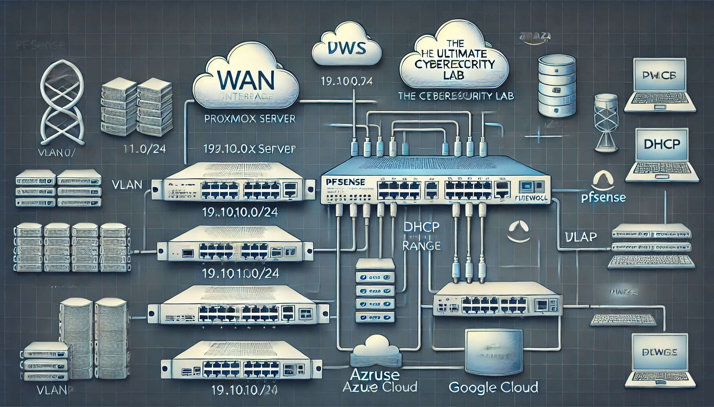

# Ultimate-Cyber-Security-Lab
Ultimate Cyber Security Lab
# Ultimate Cybersecurity Lab Project

## Overview
This guide provides step-by-step instructions for setting up a fully functional cybersecurity lab. The goal is to create an isolated, controlled environment for penetration testing, threat hunting, and adversary emulation.


## The Ultimate Cybersecurity Lab

This repository contains high-level (HLD) and low-level (LLD) network architecture diagrams for setting up a comprehensive cybersecurity lab.




For more details, refer to the respective documentation files.

## Components Installed:
- **pfSense Firewall** for network segmentation and traffic control.
- **Kali Linux VM** as our main attack and management machine.
- **Ubuntu Server with Docker & Portainer** for hosting various security tools and vulnerable applications.

## Network Configuration:
To properly isolate and manage traffic, VLANs were created within **pfSense**:
- **VLAN 10** - Security Tools (Kali Linux, SIEM, and analysis tools)
- **VLAN 20** - Vulnerable Machines (Metasploitable, DVWA, WebGoat)
- **VLAN 30** - Docker & Containers (Hosting security and utility applications)
- **VLAN 40** - Active Directory Environment (Windows Server & workstations)

Firewall rules and **DHCP** were configured to ensure proper segmentation while maintaining access for essential communication.

## Installation Steps:
1. **Set up pfSense Firewall:**
   - Installed on a VM with two network interfaces (WAN and LAN)
   - Configured VLANs and assigned static IPs
   - Created firewall rules to allow necessary traffic
   
2. **Deploy Kali Linux:**
   ```bash
   sudo apt update && sudo apt install kali-linux-full -y
   ```
   - Installed **Metasploit**, **Burp Suite**, **Nmap**, and other essential tools
   - Configured SSH for remote management
   
3. **Set up Docker and Portainer:**
   ```bash
   sudo apt update && sudo apt install -y docker.io
   sudo docker volume create portainer_data
   sudo docker run -d -p 9443:9443 --name=portainer --restart=always \
       -v /var/run/docker.sock:/var/run/docker.sock \
       -v portainer_data:/data portainer/portainer-ce:latest
   ```
   - Docker will be used to deploy **SIEM, threat hunting, and monitoring tools**

## Deploying Vulnerable Machines
A cybersecurity lab needs intentionally vulnerable machines for testing exploits and security tools.

### Deployed Machines:
- **Metasploitable 2 VM** - A deliberately vulnerable Linux-based VM.
- **Docker Containers:**
  - **Buggy Web App** (OWASP testing app)
  - **Damn Vulnerable Web App (DVWA)** (Common web security vulnerabilities)
  - **WebGoat** (OWASP training platform)

### Installation Commands:
```bash
# Download and deploy Metasploitable 2
wget http://example.com/metasploitable2.zip
unzip metasploitable2.zip
```
```bash
# Deploy vulnerable web applications
sudo docker run -d --name dvwa -p 8081:80 vulnerables/web-dvwa
sudo docker run -d --name webgoat -p 8082:8080 webgoat/webgoat
```

## Installing Security Tools
### Wazuh (SIEM & XDR) Installation
Wazuh is an open-source SIEM and XDR tool for **log collection, security monitoring, and threat detection**.
```bash
curl -sO https://packages.wazuh.com/4.x/wazuh-install.sh
sudo bash wazuh-install.sh
```
- Configured **Wazuh Agents** on:
  - **Kali Linux** (for attack monitoring)
  - **Docker Server & Containers**
  - **pfSense Firewall** (via SSH & syslog forwarding)

### Nessus (Vulnerability Scanner):
Nessus is used to perform **vulnerability scanning** on all machines in the lab.
```bash
wget https://www.tenable.com/downloads/api/v1/public/pages/nessus/downloads/11187/download?i_agree_to_tenable_license_agreement=true
sudo dpkg -i Nessus-10.1.0.deb
```

## Adversary Emulation & Threat Hunting
### Caldera (Adversary Emulation)
MITRE Caldera is used for **simulating advanced persistent threats (APTs)** to test defenses.
```bash
git clone https://github.com/mitre/caldera.git --branch 4.2.0
cd caldera
pip3 install -r requirements.txt
python3 server.py --insecure
```
### Security Onion Deployment
Security Onion is a **threat hunting and network monitoring platform**.
```bash
sudo bash securityonion-setup.sh
```

## Setting Up Windows Domain
### Windows Server 2022 (Active Directory)
Windows Server is used to create a realistic corporate environment.
```powershell
Install-WindowsFeature AD-Domain-Services -IncludeManagementTools
New-ADForest -DomainName "lab.local"
```
### Group Policy & Security Configurations
```powershell
New-GPO -Name "Map Network Drive" | Set-GPPermission -PermissionLevel GPORead
```

## Incident Response Platform
### TheHive & Cortex (Incident Response & Threat Analysis)
```yaml
version: "3"
services:
  thehive:
    image: thehiveproject/thehive
    ports:
      - "9000:9000"
  cortex:
    image: thehiveproject/cortex
    ports:
      - "9001:9001"
```
```bash
sudo docker-compose up -d
```

## Expanding to the Cloud
### Azure Cloud Expansion & VPN Integration
To simulate hybrid environments, we extend the lab to Azure.
```bash
az network vnet create --name labVNet --resource-group lab-prod --address-prefix 10.30.0.0/16
az network vnet subnet create --vnet-name labVNet --resource-group lab-prod --name GatewaySubnet --address-prefix 10.30.0.0/27
```
- Configured **Site-to-Site VPN** with pfSense
- Implemented **Dynamic DNS (DuckDNS)** for remote access

## Conclusion
The **Ultimate Cybersecurity Lab** is now fully operational and includes:
- **Network Segmentation (pfSense & VLANs)**
- **Threat Detection (Wazuh, Security Onion, Nessus)**
- **Adversary Simulation (Caldera)**
- **Incident Response (TheHive & Cortex)**
- **Hybrid Cloud Integration (Azure VPN)**

### Next Steps:
- Optimize **SIEM alert tuning**
- Deep-dive into **threat-hunting techniques**
- Automate **attack simulations using MITRE ATT&CK**

This lab provides a hands-on approach to learning **penetration testing, threat detection, and incident response**, making it an essential setup for cybersecurity professionals.

